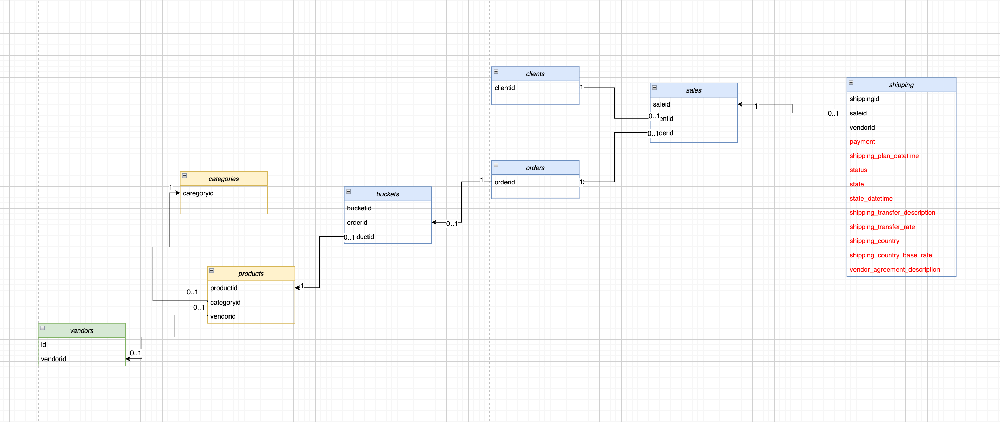
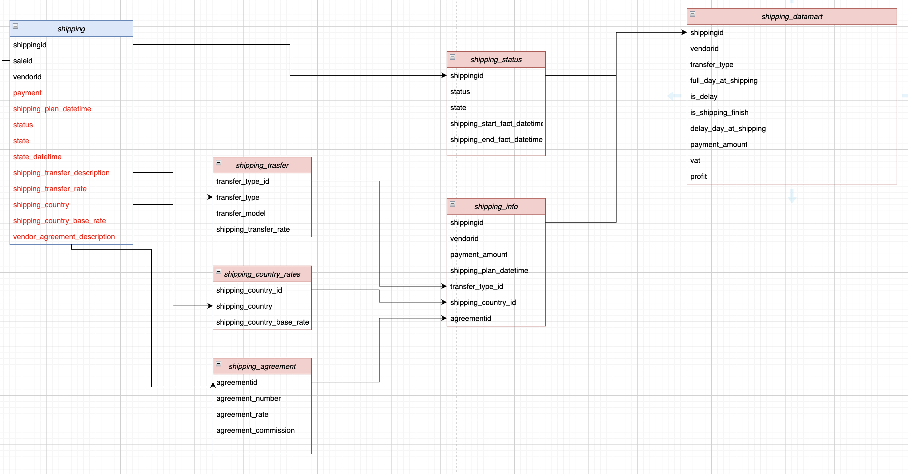

# Описание задачи

**Задача:** Сделать миграцию в отдельные логические таблицы, а затем собрать на них витрину данных.

**Брифинг:**
В какой-то момент времени компания понимает, что интернет-магазин становится популярным, количество пользователей растет, расширяются категории и виды товаров, появляются новые атрибуты товаров. Также растет опыт и сложность аналитики, и вместе с этим увеличивается количество и "вес" запросов для построения витрин и анализа данных. Появляется потребность в новых данных по поставщикам, рекламным предложениям и другим фичам. Однако текущая модель данных не позволяет гибко расширять возможности существующей схемы, а значит ее нужно изменить. При этом нужно смигрировать уже имеющиеся данные без потерь и искажений в новую схему.
    
**Входные данные:**

1. В наличии доступ до базы данных, права на чтение, изменение, создание, удаление таблиц. 
2. Описание исходной схемы/модели данных.
)
3. Требования к новой модели (включая SLA)
    1. Таблицы модели не должны иметь избыточность.
    2. Из новой модели можно получить те же результаты запрашиваемых данных, что и из старой модели.
    3. Каждая сущность имеет свои атрибуты в рамках одной таблицы.
    4. Новая схема должна поддерживать возможность добавления новых акций и промопредложений.
    5. Из новой модели можно получить те же результаты запрашиваемых данных, что и из старой модели с временем отличающимся не более чем на 1 порядок (x10)
    6. Доступность (99,99) и надежность должны быть не хуже, чем при старой схеме.

*Таблица shipping, которая представляет собой последовательность действий при доставке, перечисленную ниже.*
- shippingid — уникальный идентификатор доставки.
- saleid — уникальный идентификатор заказа. К одному заказу может быть привязано несколько строчек shippingid, то есть логов, с информацией о доставке.
- vendorid — уникальный идентификатор вендора. К одному вендору может быть привязано множество saleid и множество строк доставки.
payment — сумма платежа (то есть дублирующаяся информация).
- shipping_plan_datetime — плановая дата доставки.
- status — статус доставки в таблице shipping по данному shippingid. Может принимать значения in_progress — доставка в процессе, либо finished — доставка завершена.
- state — промежуточные точки заказа, которые изменяются в соответствии с обновлением информации о доставке по времени state_datetime.
    - booked (пер. «заказано»);
    - fulfillment — заказ доставлен на склад отправки;
    - queued (пер. «в очереди») — заказ в очереди на запуск доставки;
    - transition (пер. «передача») — запущена доставка заказа;
    - pending (пер. «в ожидании») — заказ доставлен в пункт выдачи и ожидает получения;
    - received (пер. «получено») — покупатель забрал заказ;
    - returned (пер. «возвращено») — покупатель возвратил заказ после того, как его забрал.
- state_datetime — время обновления состояния заказа.
- shipping_transfer_description — строка со значениями transfer_type и transfer_model, записанными через :. Пример записи — 1p:car.
transfer_type — тип доставки. 1p означает, что компания берёт ответственность за доставку на себя, 3p — что за отправку ответственен вендор.
transfer_model — модель доставки, то есть способ, которым заказ доставляется до точки: car — машиной, train — поездом, ship — кораблем, airplane — самолетом, multiple — комбинированной доставкой.
- shipping_transfer_rate — процент стоимости доставки для вендора в зависимости от типа и модели доставки, который взимается интернет-магазином для покрытия расходов.
- shipping_country — страна доставки, учитывая описание тарифа для каждой страны.
- shipping_country_base_rate — налог на доставку в страну, который является процентом от стоимости payment_amount.
- vendor_agreement_description — строка, в которой содержатся данные agreementid, agreement_number, agreement_rate, agreement_commission, записанные через разделитель :. Пример записи — 12:vsp-34:0.02:0.023.
agreementid — идентификатор договора. agreement_number — номер договора в бухгалтерии. agreement_rate — ставка налога за стоимость доставки товара для вендора. agreement_commission — комиссия, то есть доля в платеже являющаяся доходом компании от сделки.

**Сложности:** если искать эти данные в таблице исходных логов доставки, нагрузка на хранилище будет не оптимальна. Придется усложнять запросы, что может привести к ошибкам. Сейчас эти данные хранятся в одной таблице, shipping.

**Особенности:** заказ в интернет-магазине — это набор купленных товаров и их количество. Каждый заказ из набора товаров формируется в одну сущность доставки.

**Ожидаемый результат:** 
1.  Оптимизирует нагрузку на хранилище.
2.  Пзволит аналитикам, перед которыми стоит задача построить анализ эффективности и прибыльности бизнеса, отвечать на точечные вопросы о тарифах вендоров, стоимости доставки в разные страны, количестве доставленных заказов за последнюю неделю.

**Новая модель:** 
